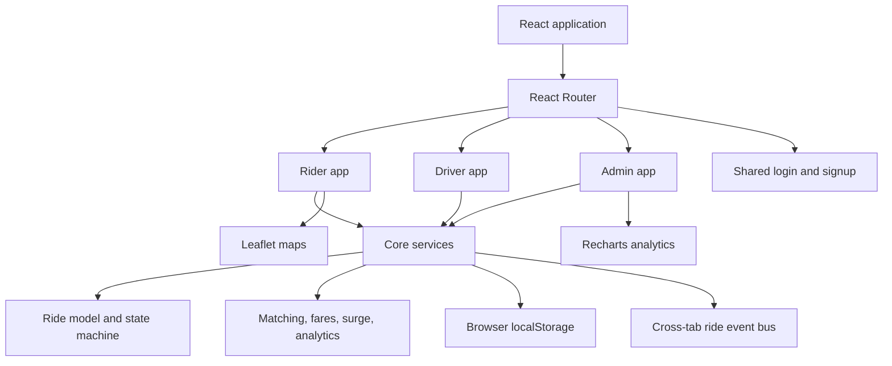

# GoRide System

GoRide is a ride-hailing demo for Colombo, Sri Lanka. It includes rider booking and trip tracking, driver dispatch and earnings, and an operations console for driver approvals, rides, analytics, and pricing. The current implementation is a browser-based prototype backed by local storage and a small cross-tab event bus; it does not require a hosted API.

## Architecture



## Features

- Shared sign-in and rider/driver registration with driver approval workflow.
- Rider trip booking, ride history, saved places, and live trip status.
- Driver online presence, simulated location, ride requests, trip controls, and earnings.
- Admin dashboard, driver approvals, ride management, reporting, pricing, promos, and audit history.
- Seeded Colombo demo data, locally persisted per browser origin.
- Responsive rider/driver layouts and a desktop-first admin workspace.

## Setup

Requirements: Node.js 20 or newer and npm.

```bash
npm install
npm run dev
```

Open the local URL printed by Vite. Seed data initializes automatically on a fresh origin. To regenerate it, clear that origin's local storage and reload.

Useful commands:

```bash
npm run check
npm run build
npm run preview
```

`npm run check` currently runs the production build, which also checks JSX imports and bundling.

## Demo Credentials

| Role | Username | Password | Notes |
| --- | --- | --- | --- |
| Admin | `admin` | `admin123` | Opens the operations dashboard. |
| Rider | Create an account | Your chosen password | Signup creates an active rider account. |
| Driver | Create an account | Your chosen password | New driver accounts require admin approval. |

Seeded rider and driver profiles are also available in local storage; public signup is the recommended way to exercise the onboarding flow.

## Tech Stack

- React 19 and Vite
- React Router
- Tailwind CSS with application-specific CSS
- Leaflet and React Leaflet
- Recharts
- React Icons and React Toastify
- Browser local storage for prototype persistence

## Screenshots

| Screen | Screenshot |
| --- | --- |
| Rider booking and tracking | `docs/screenshots/rider-booking.png` placeholder |
| Driver trip workspace | `docs/screenshots/driver-trip.png` placeholder |
| Admin operations dashboard | `docs/screenshots/admin-dashboard.png` placeholder |

## Future Enhancements

- Replace the local event bus with authenticated WebSocket delivery and reconnect handling.
- Move users, rides, pricing, and audit history to a real backend and database.
- Integrate a payment gateway, refunds, and verified payout workflows.
- Add production identity verification, document storage, and role-based authorization.